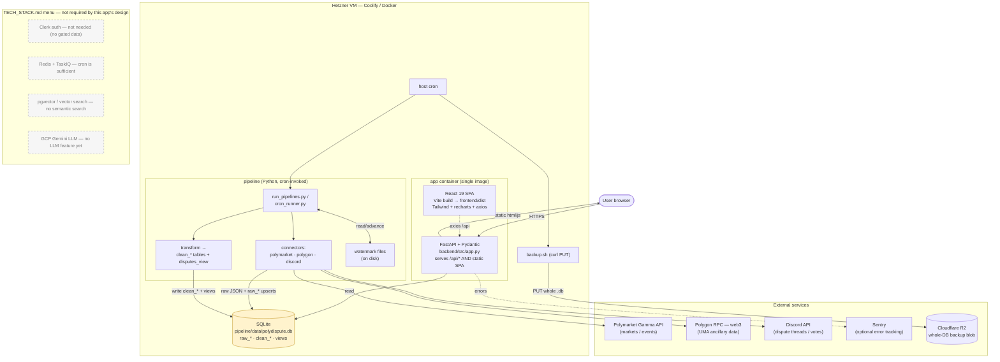

# Polydispute — System Architecture

Reflects the **actual build** (not the generic TECH_STACK.md template).
Single-container monolith: FastAPI serves both `/api/*` and the built React SPA.
One SQLite file is the whole datastore. A cron-driven Python pipeline writes to it.

## Notes

The template is a menu: components are pulled in only when a design requirement calls
for one. This app's requirements need none of Clerk / cloud DB / Redis+TaskIQ /
pgvector / Gemini, so their absence is intentional, not a gap.

Real items to watch (consequences of the chosen SQLite + cron + single-VM stack):

- **SQLite single-writer:** pipeline (writer) and API (reader) share one file. Set
  WAL mode + busy_timeout or reads will hit `database is locked` during a write.
- **Silent staleness:** the risky failure is the watermark quietly not advancing —
  Sentry won't catch it (nothing throws). Watch the `pipeline_runs` table.
- **Single file, single VM:** `backup.sh` PUTs the whole DB to R2 (good). Add
  retention/versioning and test `restore.sh` once.
