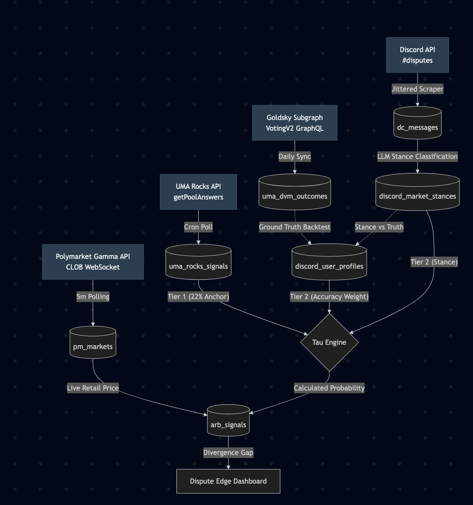
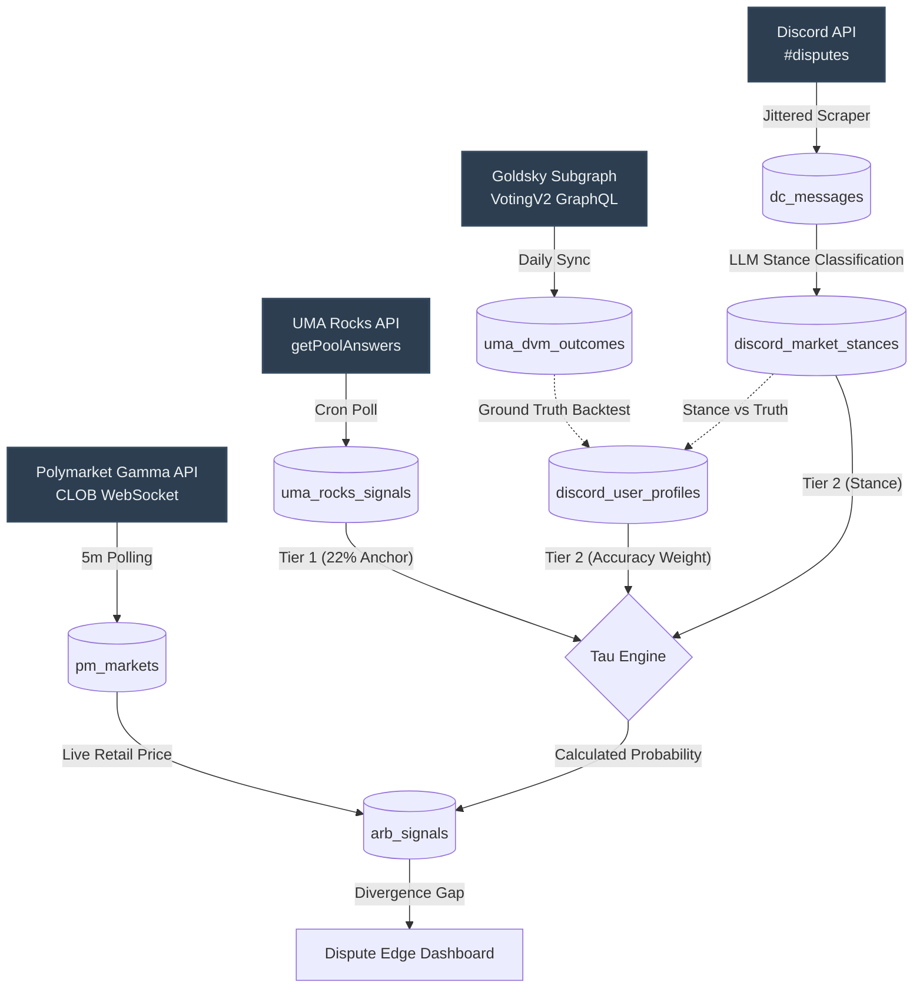

# Polydispute — Dashboard & Data Model Architecture (V3 - Hybrid)

This plan formalizes the "Hybrid Approach" architecture, allowing us to calculate `Tau` (the probability of a dispute outcome) without ever mapping Discord usernames to Ethereum wallets.

## User Review Required

> [!IMPORTANT]
> **Tau Function Definition**: Please review the **Computation Pipeline** section below. Since we cannot use explicit token weights for Discord users, we are replacing "Token Weight" with "Historical Accuracy Weight". Does this conceptual math align with your trading strategy?

---

## Architecture & Data Flow Diagram

---

## 1. Product UI Ideation

The product remains a single-pane-of-glass dashboard, but the "Dispute X-Ray" now reflects the tiered data model.

### Page 1: The "Edge" Dashboard (Macro View)
- **Data Table**: Active disputes sorted by **Arb Spread**.
- **Columns**:
  - **Market**: Question snippet + Link to PM.
  - **PM Price**: Current retail consensus (e.g., "80¢ YES").
  - **Calculated Tau**: The projected outcome based on the hybrid model (e.g., "15% YES").
  - **Arb Spread**: The delta (`|PM Price - Tau|`). This is the edge.

### Page 2: Dispute X-Ray (Micro View)
**Goal**: Explain the `Tau` calculation purely through Tier 1 and Tier 2 components.
- **Tier 1 Signal (The Anchor)**:
  - **UMA Rocks Pool (22% Supply)**: Shows the live API pre-commitment. (e.g., "UMA Rocks intends to vote NO").
- **Tier 2 Signals (The Social Movers)**:
  - A ledger of active Discord users in the current `#disputes` thread.
  - Columns: `Username` | `Stated Stance (LLM)` | `Historical Accuracy %`.
  - e.g., "@arb_expert | Stance: NO | 96% Accuracy (24/25 disputes)".
- **The Discord Feed**: Raw messages for qualitative context.

---

## 2. Relational Data Model

We completely remove on-chain wallet mapping for individual users.

### Existing Tables
- `pm_events`: High-level Polymarket event wrappers.
- `pm_markets`: Individual disputes. *Primary Key: `id`*.
- `dc_threads` & `dc_messages`: Raw Discord data.

### New Tables Required

#### 1. `discord_user_profiles` (Tier 2 Tracker)
Tracks off-chain entities and their historical predictive power.
- `discord_user_id` (PK)
- `username`
- `total_predictions` — How many historical disputes they stated a stance on.
- `lifetime_accuracy` — What % of the time their stated stance matched the final UMA DVM resolution.

#### 2. `discord_market_stances` (Tier 2 Live Signals)
The LLM output for a user on a specific live dispute.
- `id` (PK)
- `market_id` (FK to `pm_markets.id`)
- `discord_user_id` (FK to `discord_user_profiles`)
- `stance` — `YES`, `NO`, or `NEUTRAL`.
- `confidence` — LLM classification confidence.

#### 3. `uma_rocks_signals` (Tier 1 Tracker)
Stores the API pre-commitments from `getPoolAnswers`.
- `market_id` (PK)
- `stance` — `YES` or `NO`.
- `timestamp`

#### 4. `arb_signals` (The Edge Feed)
Snapshot table updated every 5 minutes to feed the dashboard.
- `market_id` (FK to `pm_markets.id`)
- `timestamp`
- `pm_price_yes`
- `tau_yes`
- `arb_spread`

---

## 3. The Computation Pipeline (The Hybrid Math)

To calculate `Tau` without token weights, we use a Bayesian or weighted-average approach:

1. **The Anchor (Tier 1)**: UMA Rocks represents ~22% of the total supply. Because voter turnout is rarely 100%, 22% of the *total* supply usually translates to ~40-60% of the *active* voting quorum. This forms the baseline `Tau`. 
2. **The Social Shift (Tier 2)**: We fetch all users in `discord_market_stances` for the active dispute.
3. **Accuracy Weighting**: We multiply each user's `stance` by their `lifetime_accuracy` score in `discord_user_profiles`. A user with 99% accuracy exerts massive pull on `Tau`; a user with 50% accuracy is ignored as noise.
4. **The Formula**: 
   `Tau = (Tier 1 Base) ± (Weighted Sum of Tier 2 Social Signals)`
5. **Calculate Arb Spread**: Fetch live PM orderbook price, subtract `Tau`, and write to `arb_signals`.
6. **Historical Backfill (Daily Batch Job)**: After a dispute resolves, a script compares every user's `stance` in `discord_market_stances` against the final on-chain DVM outcome and updates their `lifetime_accuracy` in `discord_user_profiles`.

## Verification Plan

1. **Schema Migration**: Write SQL script to create `discord_user_profiles`, `discord_market_stances`, `uma_rocks_signals`, and `arb_signals` in `polydispute.db`.
2. **Historical NLP Backfill**: Run the LLM over the 11k historical Discord messages to retroactively grade the community and populate the initial `lifetime_accuracy` scores.
